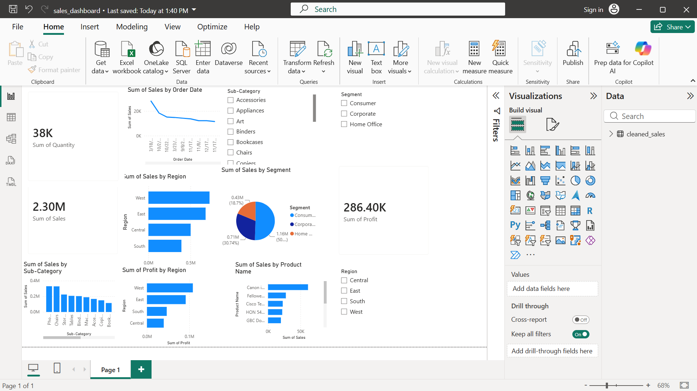

# Sales Analytics Dashboard

## Overview
A data analytics project that cleans sales data, performs analysis, and builds an interactive Power BI dashboard.

## Technologies Used

- Python
- Pandas
- SQL
- SQLite
- Power BI

## Project Structure

Sales_Analytics_Dashboard/
│
├── data/
│ └── sales_data.csv
│
├── sql/
│ └── sales_queries.sql
│
├── notebooks/
│ └── eda.ipynb
│
├── output/
│ ├── cleaned_sales.csv
│ └── sales_summary.csv
│
├── src/
│ ├── data_cleaning.py
│ └── database.py
│
└── dashboard/
├── sales_dashboard.pbix
└── dashboard_preview.png

## Dashboard Preview

## Features

- Data cleaning and preprocessing
- Sales trend analysis
- Profit analysis
- Product/category analysis
- Region-wise analysis
- Interactive Power BI dashboard

## Dashboard File

The Power BI dashboard is available here:

`dashboard/sales_dashboard.pbix`

Open it using Power BI Desktop.